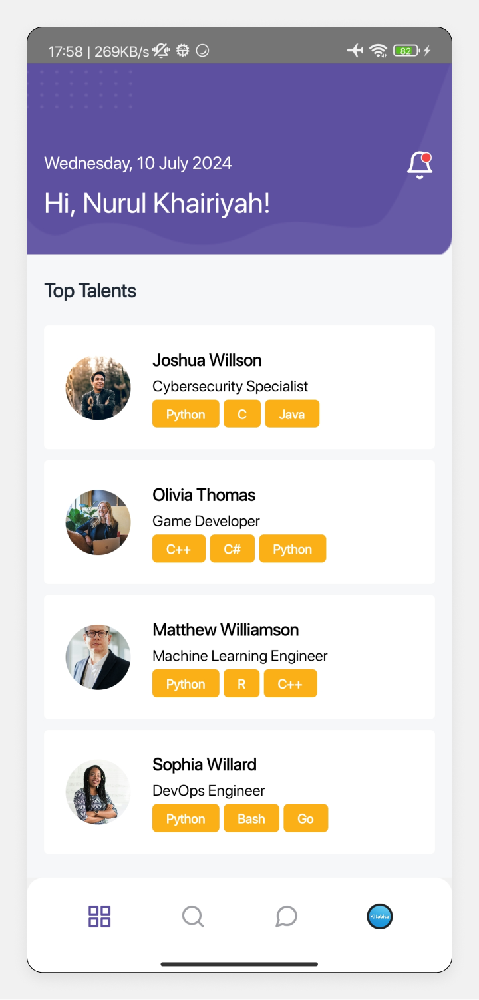
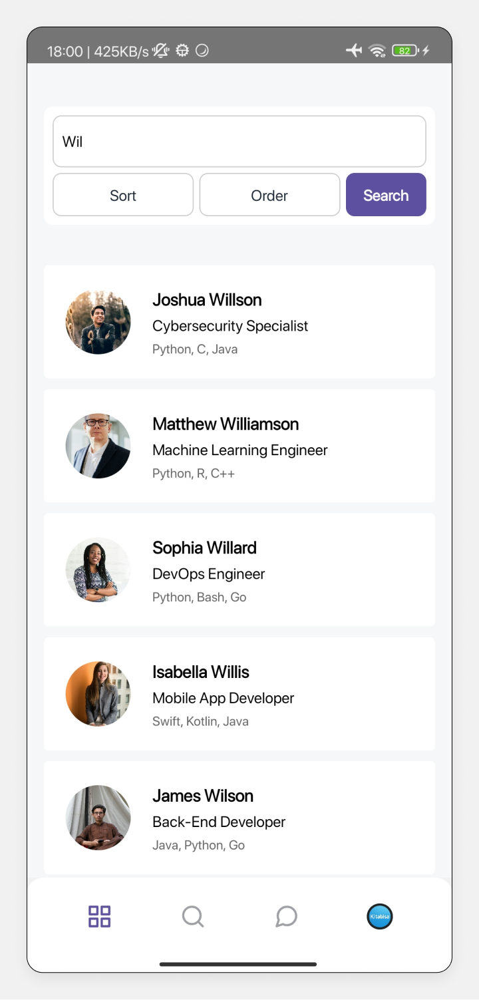
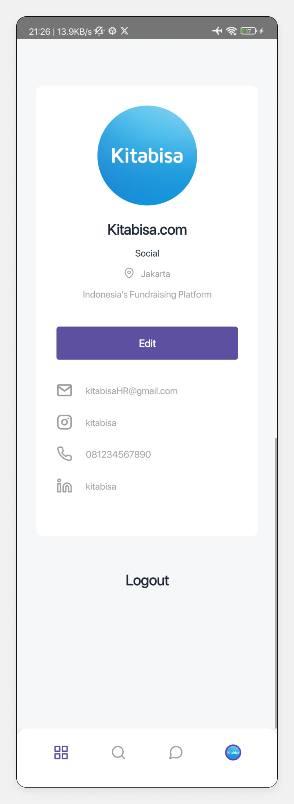

<a id="readme-top"></a>

<br />
<div align="center">
  <a href="https://github.com/naufandarmawan/peworld-mobile">
    
  </a>

  <h3 align="center">Peworld</h3>
  <p align="center">
    Job Placement Platform (Mobile Application)
  </p>
</div>


<details>
  <summary>Table of Contents</summary>
  <ol>
    <li>
      <a href="#about-the-project">About The Project</a>
      <ul>
        <li><a href="#built-with">Built With</a></li>
        <li><a href="#features">Features</a></li>
        <li><a href="#screenshots">Screeshots</a></li>
      </ul>
    </li>
    <li>
      <a href="#getting-started">Getting Started</a>
      <ul>
        <li><a href="#prerequisites">Prerequisites</a></li>
        <li><a href="#installation">Installation</a></li>
        <li><a href="#development">Development</a></li>
        <li><a href="#production">Production</a></li>
      </ul>
    </li>
    <li><a href="#contributing">Contributing</a></li>
    <li><a href="#related-projects">Related Projects</a></li>
    <li><a href="#license">License</a></li>
    <li><a href="#contact">Contact</a></li>
  </ol>
</details>


## About The Project

In response to industry demands, where 72% of companies rely on mobile applications for recruitment, Peworld Mobile provides an innovative solution to streamline the recruitment process. It allows talent to easily access the latest career opportunities anywhere, while expanding companies' reach globally.

<p align="right">(<a href="#readme-top">back to top</a>)</p>


### Built With

* React Native
* Axios 
* Redux


<p align="right">(<a href="#readme-top">back to top</a>)</p>


### Features

* Account creation, 
* Display and search worker listings, 
* Worker detail view, 
* Profile editing, 
* Password reset, 
* Push notifications,
* Skill management, 
* Portfolio and work experience management, 
* Profile photo upload directly from the user's camera.


<p align="right">(<a href="#readme-top">back to top</a>)</p>


### Screenshots

<table style="width: 100%; border-collapse: collapse;">
  <colgroup>
    <col style="width: 25%;">
    <col style="width: 25%;">
    <col style="width: 25%;">
    <col style="width: 25%;">
  </colgroup>
  <tr>
    <th style="padding: 8px; text-align: center; border: 1px solid #ddd;">Splash Screen</th>
    <th style="padding: 8px; text-align: center; border: 1px solid #ddd;">Login Option Page</th>
    <th style="padding: 8px; text-align: center; border: 1px solid #ddd;">Worker Login Page</th>
    <th style="padding: 8px; text-align: center; border: 1px solid #ddd;">Worker Register Page</th>
  </tr>
  <tr>
    <td style="padding: 8px; text-align: left; border: 1px solid #ddd;">
      <div style="width: 100%; height: 300px; overflow: hidden;">
        
      </div>
    </td>
    <td style="padding: 8px; text-align: left; border: 1px solid #ddd;">
      <div style="width: 100%; height: 300px; overflow: hidden;">
        
      </div>
    </td>
    <td style="padding: 8px; text-align: left; border: 1px solid #ddd;">
      <div style="width: 100%; height: 300px; overflow: hidden;">
        
      </div>
    </td>
    <td style="padding: 8px; text-align: left; border: 1px solid #ddd;">
      <div style="width: 100%; height: 300px; overflow: hidden;">
        
      </div>
    </td>
  </tr>
  <tr>
    <th style="padding: 8px; text-align: center; border: 1px solid #ddd;">Recruiter Login Page</th>
    <th style="padding: 8px; text-align: center; border: 1px solid #ddd;">Recruiter Register Page</th>
    <th style="padding: 8px; text-align: center; border: 1px solid #ddd;">Reset Password Page</th>
    <th style="padding: 8px; text-align: center; border: 1px solid #ddd;">Home Page</th>
  </tr>
  <tr>
    <td style="padding: 8px; text-align: left; border: 1px solid #ddd;">
      <div style="width: 100%; height: 300px; overflow: hidden;">
        
      </div>
    </td>
    <td style="padding: 8px; text-align: left; border: 1px solid #ddd;">
      <div style="width: 100%; height: 300px; overflow: hidden;">
        
      </div>
    </td>
    <td style="padding: 8px; text-align: left; border: 1px solid #ddd;">
      <div style="width: 100%; height: 300px; overflow: hidden;">
        
      </div>
    </td>
    <td style="padding: 8px; text-align: left; border: 1px solid #ddd;">
      <div style="width: 100%; height: 300px; overflow: hidden;">
        
      </div>
    </td>
  </tr>
  <tr>
    <th style="padding: 8px; text-align: center; border: 1px solid #ddd;">Notification Page</th>
    <th style="padding: 8px; text-align: center; border: 1px solid #ddd;">Search Page</th>
    <th style="padding: 8px; text-align: center; border: 1px solid #ddd;">Inbox Page</th>
    <th style="padding: 8px; text-align: center; border: 1px solid #ddd;">Worker Profile Page</th>
  </tr>
  <tr>
    <td style="padding: 8px; text-align: left; border: 1px solid #ddd;">
      <div style="width: 100%; height: 300px; overflow: hidden;">
        
      </div>
    </td>
    <td style="padding: 8px; text-align: left; border: 1px solid #ddd;">
      <div style="width: 100%; height: 300px; overflow: hidden;">
        
      </div>
    </td>
    <td style="padding: 8px; text-align: left; border: 1px solid #ddd;">
      <div style="width: 100%; height: 300px; overflow: hidden;">
        
      </div>
    </td>
    <td style="padding: 8px; text-align: left; border: 1px solid #ddd;">
      <div style="width: 100%; height: 300px; overflow: hidden;">
        
      </div>
    </td>
  </tr>
  <tr>
    <th style="padding: 8px; text-align: center; border: 1px solid #ddd;">Edit Worker Profile Page</th>
    <th style="padding: 8px; text-align: center; border: 1px solid #ddd;">Recruiter Profile Page</th>
    <th style="padding: 8px; text-align: center; border: 1px solid #ddd;">Edit Recruiter Profile Page</th>
    <th style="padding: 8px; text-align: center; border: 1px solid #ddd;">Worker Details Page</th>
  </tr>
  <tr>
    <td style="padding: 8px; text-align: left; border: 1px solid #ddd;">
      <div style="width: 100%; height: 300px; overflow: hidden;">
        
      </div>
    </td>
    <td style="padding: 8px; text-align: left; border: 1px solid #ddd;">
      <div style="width: 100%; height: 300px; overflow: hidden;">
        
      </div>
    </td>
    <td style="padding: 8px; text-align: left; border: 1px solid #ddd;">
      <div style="width: 100%; height: 300px; overflow: hidden;">
        
      </div>
    </td>
    <td style="padding: 8px; text-align: left; border: 1px solid #ddd;">
      <div style="width: 100%; height: 300px; overflow: hidden;">
        
      </div>
    </td>
  </tr>
  <!-- Repeat similar rows for more screenshots -->
</table>

<p align="right">(<a href="#readme-top">back to top</a>)</p>


## Getting Started

To set up and run the project locally, follow these steps:

### Prerequisites

Before starting, make sure you have npm and the React Native CLI installed. You can install them globally using:

* npm
  ```sh
  npm install npm@latest -g
  ```
* React Native CLI
  ```sh
  npm install -g react-native-cli
  ```

### Installation

1. Clone the repository:
   ```sh
   git clone https://github.com/naufandarmawan/peworld-mobile.git
   ```
2. Navigate into the project directory:
   ```sh
   cd peworld-mobile
   ```
3. Install dependencies:
   ```sh
   npm install
   ```
4. Set up environment variables:
   * Create a `.env` file in the root directory of your project.
   * Add your environment variables to the `.env` file following the structure in the `.env.example` file:
   ```js
   API_URL = 'https://your-api-url.com/'
   ONESIGNAL_ID = 'your-onesignal-id'
   ```
   * Replace https://your-api-url.com/ and your-onesignal-id with your actual API URL and OneSignal ID.

### Development

5. Start the development server:
   ```sh
   npm run dev
   ```
6. Run the app on an Android device or emulator:
   ```sh
   npm run android
   ```

### Production

7. Build the project:
   ```sh
   npm run build
   ```
8. Start the production server:
   ```sh
   npm run start
   ```

By following these steps, you'll have everything set up to run the project locally on your machine.

<p align="right">(<a href="#readme-top">back to top</a>)</p>


## Contributing

Contributions are what make the open source community such an amazing place to learn, inspire, and create. Any contributions you make are **greatly appreciated**.

If you have a suggestion that would make this better, please fork the repo and create a pull request. You can also simply open an issue with the tag "enhancement".

Don't forget to give the project a star! Thanks again!

1. Fork the Project
2. Create your Feature Branch (`git checkout -b feature/AmazingFeature`)
3. Commit your Changes (`git commit -m 'Add some AmazingFeature'`)
4. Push to the Branch (`git push origin feature/AmazingFeature`)
5. Open a Pull Request

<p align="right">(<a href="#readme-top">back to top</a>)</p>


## Related Projects

Here are some related projects and resources you may find helpful. These include demo links, backend links, and other projects from my portfolio:

* Peworld Mobile App Demo: [APK Release](#)
* Peworld Backend: [Backend Repository](https://github.com/naufandarmawan/peworld-be)
* Peworld Web App: [Frontend Repository](https://github.com/naufandarmawan/peworld-fe)

### My Other Portfolios

<table style="width: 100%; border-collapse: collapse;">
<colgroup>
    <col style="width: 33.33%;">
    <col style="width: 33.33%;">
    <col style="width: 33.33%;">
  </colgroup>
  <tr>
    <th style="padding: 8px; text-align: center; border: 1px solid #ddd;">Peworld Web App</th>
    <!-- <th style="padding: 8px; text-align: center; border: 1px solid #ddd;">Peworld Mobile App</th> -->
    <th style="padding: 8px; text-align: center; border: 1px solid #ddd;">MamaRecipe Web App</th>
    <th style="padding: 8px; text-align: center; border: 1px solid #ddd;">Blanja Web App</th>
  </tr>
  <tr>
    <td style="padding: 8px; text-align: left; border: 1px solid #ddd;"><a href="https://github.com/naufandarmawan/peworld-fe"></a></td>
    <!-- <td style="padding: 8px; text-align: left; border: 1px solid #ddd;"><a href="https://github.com/naufandarmawan/peworld-mobile"></a></td> -->
    <td style="padding: 8px; text-align: left; border: 1px solid #ddd;"><a href="https://github.com/naufandarmawan/mamarecipe-fe"></a></td>
    <td style="padding: 8px; text-align: left; border: 1px solid #ddd;"><a href="https://github.com/naufandarmawan/blanja-fe"></a></td>
  </tr>
  <!-- Repeat similar rows for more screenshots -->
</table>

<p align="right">(<a href="#readme-top">back to top</a>)</p>


## License

Distributed under the MIT License. See <a href="https://github.com/naufandarmawan/peworld-mobile/blob/main/LICENSE">`LICENSE`</a> for more information.

<p align="right">(<a href="#readme-top">back to top</a>)</p>


-----


<p align="center" id="contact">© Peworld 2024</p>
<p align="center">
<a href="https://github.com/naufandarmawan/"> Naufan Darmawan </a> - <a href="mailto:naufandarmawan@gmail.com">naufandarmawan@gmail.com</a> - <a href="https://www.linkedin.com/in/naufandarmawan/">LinkedIn</a>
</p>
